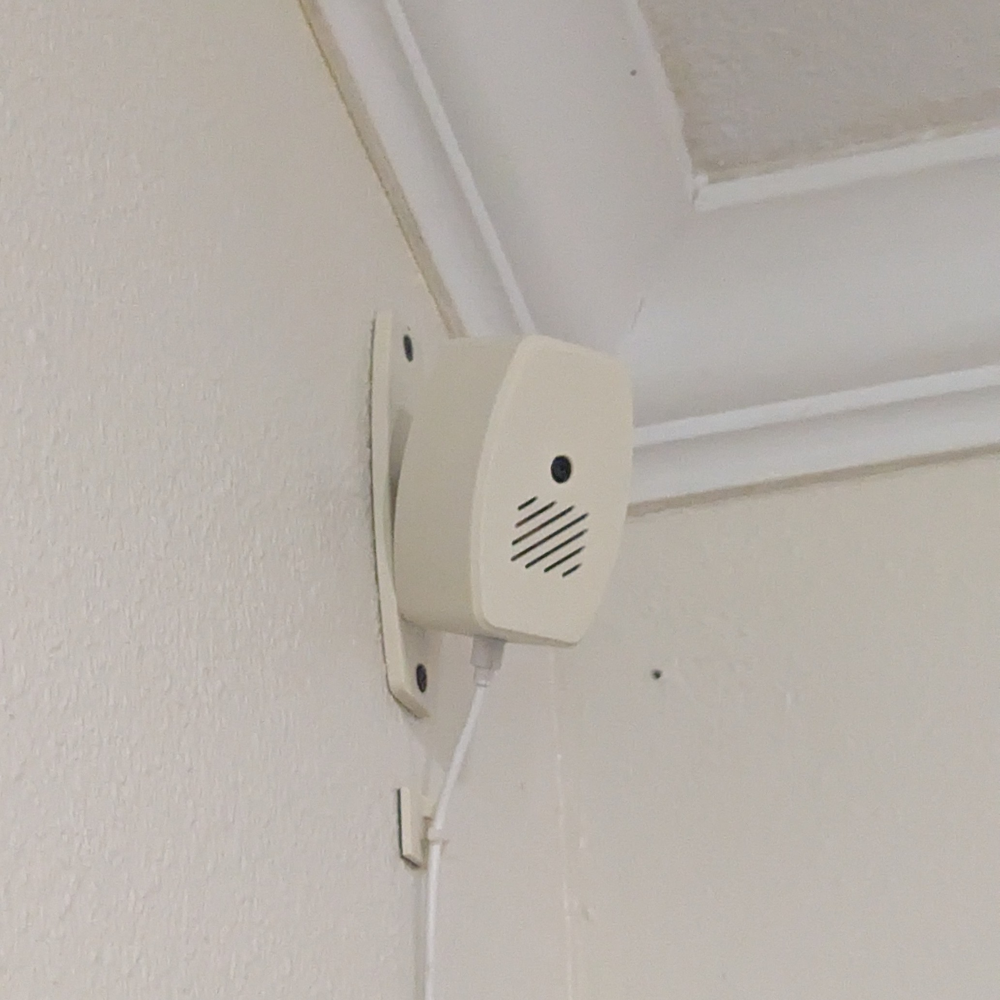
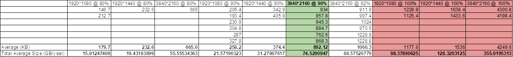
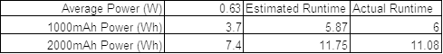
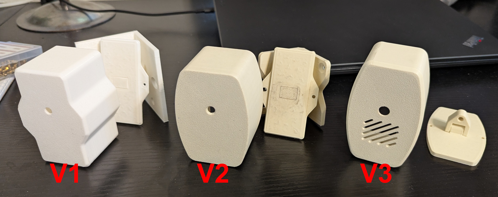
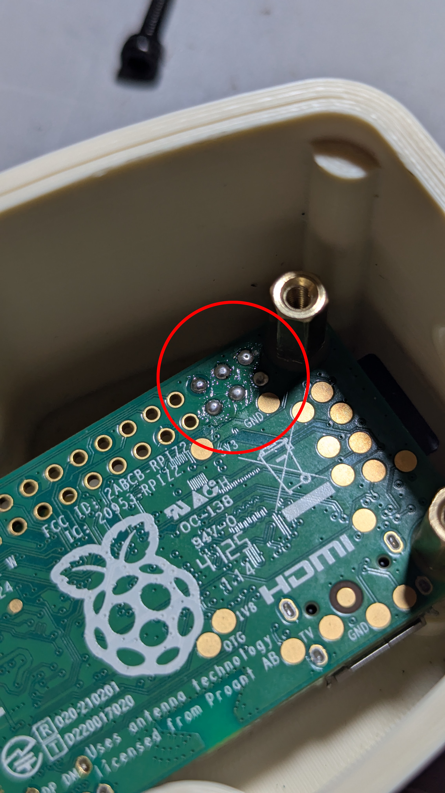

# HereCam (WIP)
A camera for making yearly timelapses of a single room. Uses a Pi zero 2w, camera, and UPS hat. Inspired by the movie _Here_ (2024).

## Goals
- [x] Create a device that takes a picture at set intervals over the course of a year.
- [x] Store images on an SD card or SSD with easy removal.
- [x] Set up nightly automated backups to external server over wifi.
- [x] Be able to compile a years worth of images into a single timeplapse video
- [x] The timeplapse must have a reasonable play time (<1hr) and good quality.
- [ ] Must be able to operate without AC power for at least 12 hrs.
- [ ] Under $300 (2026 USD)

## Components
- Raspberry Pi Zero 2W - small form factor, wireless, enough processing power for timelapse compilation and image capture, and sd card slot.
- 75° Pi Camera module - FOV should be wide enough for being in the corner of a room, with IR filter.
- UPS hat - back-up power for when the device is unplugged, uses a lipo battery.
- SD card - capable of containing Pi OS and room for images, highly reliable card.
- Wall adapter - 5v slim form factor wall adapter
(see BOM for details of all components)

## Calculations

### 1. Length of Timelapse and number of images
   The first step was to find out how long I would want the timplapse to be and the framerate of the movie, which would also tell me the number of images that would be taken each year. I knew I did not want to capture images of every single hour, because the room I would be mounting the camera would have no one in it late at night (a living room). So I went with 20 hours per day (6am-2am). I also knew I wanted at least 24fps.
   
   

   I ended up liking two durations at 12 pics per hour (one image every 5 mins). This would give me a total of 87600 images/year. I liked the option of having a short timelapse (about 15 minutes and a longer at about 1 hour). The FPS of the short timelapse would be 100fps and the longer would be 24fps.
   
### 2. Storage size requirements
Now that I knew how many images I would have to store, I needed to calculate which resolution I would desire for a good quality video, yet not having a huge storage requirement. I was aiming for less than 256GB of images per year. I took pictures on my phone at 3 different resolutions and jpeg qualities. 1920x1080, 1920x1440, and 3840x2160 at 80%, 90%, and 100% (I ended up also trying 92% for the 3840x2160 resolution). I found that both the 1920x1080 and 1920x1440 resolutions did not look near crisp enough for my taste, so I stuck with the 3840x2160 resolution. JPEG compression somewhat works based on the actual image, so my test were done in about the expected positions that I would possibly mount the camera and then averaged together for a file average image size. The table below shows the final average values in KB for each image and in GB for the total 87600 images.

   

   All the 100% compression rates sizes were larger than I was wanting, but 90% and even 92% for the 3840x2160 was well under the 256GB I was wanting (the OS will eat up some of the SD card, will have to keep that in mind). I had at first picked the 90% compression, but ended up lowering it to 85% which images average 726KB, so about 61GB per year of images.

### 3. Runtime on Battery
Once I got the UPS hat and batteries in (a 1000mAh and 2000mAh), I did some ran a demo script that measures the power being used from the battery to run the pi. While idle the pi drew about 185mA from the battery and while taking a picture the pi drew about 400mA but only for about 2 seconds. Using these values I calculated the estimated runtime for the system. The 1000mAh battery would last about 6 hours while the 2000mAh would run about 11.8 hours. I then ran 2 tests to measure the actual runtime for each battery. For these test I ran a cron script to take an image every 5 minutes and name the file the number of the total images taken. This way I could moniter the battery voltage with the demo script and see when the voltage drops to 3.0 volts (voltage when BMS on the cell cuts off). I could then multiply the number of images taken by 5 minutes to get a total runtime. The calculated and actual values are below.

   

The 2000mAh lipo is still somewhat short of 12 hrs and this runtime will only decrease, but considering the size of the the device, I do not think I can increase the lipo much more. 

## Development
I designed and 3D printed several different housing and mounting systems for the camera. My first 2 designs used a mounting system that screwed into the corner of a room, but I later changed to a 2-axis mounting system that could mount on any way, just in case in the future I put the camera not in a corner. The later designs also included a vent for heat from the Pi.

   

See the parts folder for 3D files.

## Construction

Two heat threaded inserts (2mm) and 2, 2mm socket head screws are used to mount the camera module in place. The pi/UPS modules are mounted with brass standoffs, and those standoffs are held in hexagonal pockets in the housing with JB weld. The lid to the housing is held in using 3mm heat threaded inserts and socket head screws. The mount uses 4mm socket head screws with nuts and washers to allow the camera to pivot on the 2 axes. The whole mount is fasten to the wall with regular 1-5/8" drywall screws. 

I had a lot of issues with the pogo pins of the UPS hat not aligning with the Pi's pads. To fix this I solderd the pads that contact the pogo connectors and this fixed all the issues. See the image below.

## Code

I first set up my homelab server as a network attached storage with samba share. and made it a permanent mount. This way I can send images to the server to actually view them for testing and as backup storage for the images/videos. 

For capturing the images I made a script called capture.sh (see the code folder). This script is run with Cron scheduler with the schedule of: */5 0,6-23 * * * /home/herecam/capture.sh
This captures an image every 5 minutes for the hours between 6am and midnight.

For backing up the images I used rsync to send the images to my mounted homelab with nightlyBackup.sh (see code folder). This script is run every night at 2 am, when pictures are not being taken: 0 2 * * * /home/herecam/nightlyBackup.sh

For monitoring the UPS (to see if AC power is lost) I modified the demo python script from waveshare for the hat, UPS_monitor.py (see code folder). 

